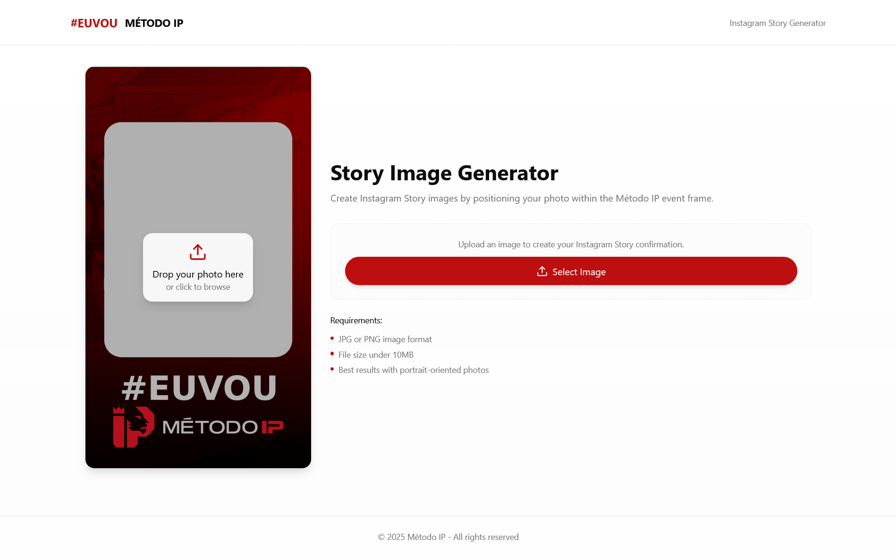

# Story Snap Generator 📸

Uma aplicação web open source para criar molduras personalizadas para eventos em formato de publicação e stories do Instagram.



## 📋 Índice

- [Sobre o Projeto](#sobre-o-projeto)
- [Funcionalidades](#funcionalidades)
- [Tecnologias Utilizadas](#tecnologias-utilizadas)
- [Instalação e Configuração](#instalação-e-configuração)
- [Como Usar](#como-usar)
- [Personalizar Molduras](#personalizar-molduras)
- [Estrutura do Projeto](#estrutura-do-projeto)
- [Deploy](#deploy)
- [Contribuir](#contribuir)
- [Licença](#licença)

## 🎯 Sobre o Projeto

O **Story Snap Generator** é uma ferramenta web que permite criar artes personalizadas com molduras para eventos, optimizadas para publicações no Instagram (feed e stories). A aplicação oferece uma interface intuitiva onde os utilizadores podem carregar as suas fotos e aplicar molduras temáticas de diferentes eventos.

### Características Principais:
- ✨ Interface moderna e responsiva
- 🖼️ Suporte para formatos de feed (1080x1080) e stories (1080x1920)
- 🎨 Editor visual com controlos de escala, rotação e posicionamento
- 📱 Optimizado para dispositivos móveis
- 🚀 Processamento em tempo real no browser
- 💾 Download instantâneo em alta qualidade

## 🚀 Funcionalidades

### Para Utilizadores
- **Upload de Imagens**: Carregue fotos em JPG, PNG ou WebP (até 10MB)
- **Editor Visual**: Ajuste escala, rotação e posição da sua foto
- **Múltiplos Formatos**: Gere automaticamente versões para feed e stories
- **Pré-visualização em Tempo Real**: Veja as alterações instantaneamente
- **Download de Alta Qualidade**: Descarregue as imagens finais em resolução completa

### Templates Disponíveis
- **Eu Vou IP**: Molduras para eventos IP
- **SDC Embaixador**: Templates para embaixadores SDC
- **SDC Eu Vou**: Molduras SDC para participação em eventos

## 🛠️ Tecnologias Utilizadas

- **Frontend**: React 18 + TypeScript
- **Build Tool**: Vite
- **Styling**: Tailwind CSS
- **UI Components**: Radix UI + shadcn/ui
- **Routing**: React Router DOM
- **Icons**: Lucide React
- **Notifications**: Sonner
- **Image Processing**: Canvas API + html-to-image
- **Forms**: React Hook Form + Zod

## 📦 Instalação e Configuração

### Pré-requisitos
- Node.js (versão 18 ou superior)
- npm ou yarn

### Passos de Instalação

1. **Clone o repositório**
```bash
git clone https://github.com/ruirda/story-snap-generator.git
cd story-snap-generator
```

2. **Instale as dependências**
```bash
npm install
# ou
yarn install
```

3. **Inicie o servidor de desenvolvimento**
```bash
npm run dev
# ou
yarn dev
```

4. **Aceda à aplicação**
Abra o browser e navegue para `http://localhost:5173`

### Scripts Disponíveis

```bash
# Desenvolvimento
npm run dev

# Build para produção
npm run build

# Build para desenvolvimento
npm run build:dev

# Pré-visualização da build
npm run preview

# Linting
npm run lint

# Deploy para GitHub Pages
npm run deploy
```

## 🎨 Como Usar

### 1. Seleccionar Template
- Aceda à página inicial
- Escolha um dos templates disponíveis
- Clique em "Usar Template"

### 2. Carregar Imagem
- Clique em "Escolher Imagem"
- Seleccione uma foto do seu dispositivo
- Formatos suportados: JPG, PNG, WebP (máx. 10MB)

### 3. Editar a Imagem
- **Escala**: Ajuste o tamanho da imagem (0.1x a 3x)
- **Rotação**: Rode a imagem (-180° a 180°)
- **Posição**: Arraste a imagem no canvas para reposicionar

### 4. Escolher Formato
- **Feed**: Formato quadrado (1080x1080px) para publicações
- **Story**: Formato vertical (1080x1920px) para stories

### 5. Descarregar
- Clique em "Descarregar" para obter a imagem final
- O ficheiro será guardado automaticamente

## 🖼️ Personalizar Molduras

### Localização das Imagens

Todas as molduras estão localizadas na pasta:
```
public/lovable-uploads/
├── eu_vou_ip_feed.png          # Moldura "Eu Vou IP" para feed
├── eu_vou_ip_story.png         # Moldura "Eu Vou IP" para story
├── SDC_Embaixador_feed.png     # Moldura "SDC Embaixador" para feed
├── SDC_Embaixador_Story.png    # Moldura "SDC Embaixador" para story
├── SDC_Eu_vou_feed.png         # Moldura "SDC Eu Vou" para feed
├── SDC_Eu_vou_story.png        # Moldura "SDC Eu Vou" para story
└── preview.png                 # Imagem de pré-visualização
```

### Modificar Molduras Existentes

Para alterar uma moldura existente:

1. **Substitua a imagem**
   - Vá à pasta `public/lovable-uploads/`
   - Substitua o ficheiro pela nova moldura
   - **Importante**: Mantenha exactamente o mesmo nome do ficheiro

2. **Nomes dos ficheiros actuais:**
   - `eu_vou_ip_feed.png` e `eu_vou_ip_story.png`
   - `SDC_Embaixador_feed.png` e `SDC_Embaixador_Story.png`
   - `SDC_Eu_vou_feed.png` e `SDC_Eu_vou_story.png`

3. **Não é necessário alterar código** - a aplicação carregará automaticamente as novas imagens

### Adicionar Novas Molduras

1. **Preparar as Imagens**
   - Crie molduras em PNG com transparência
   - Resolução obrigatória:
     - Feed: 1080x1080px
     - Story: 1080x1920px

2. **Adicionar Ficheiros**
   ```bash
   # Coloque as imagens na pasta public/lovable-uploads/
   public/lovable-uploads/
   ├── nova_moldura_feed.png
   └── nova_moldura_story.png
   ```

3. **Actualizar Referências no Código**

   **Ficheiro 1: `src/pages/Index.tsx`** (linha ~25)
   ```typescript
   const templates = [
     {
       id: "eu-vou-ip",
       name: "Eu Vou IP",
       description: "Template para eventos IP com moldura personalizada",
       feedImage: "/lovable-uploads/eu_vou_ip_feed.png",
       storyImage: "/lovable-uploads/eu_vou_ip_story.png",
       category: "Eventos IP"
     },
     // ... outros templates existentes
     {
       id: "nova-moldura",                                    // ID único
       name: "Nova Moldura",                                  // Nome a mostrar
       description: "Descrição da nova moldura",             // Descrição
       feedImage: "/lovable-uploads/nova_moldura_feed.png",   // Caminho para feed
       storyImage: "/lovable-uploads/nova_moldura_story.png", // Caminho para story
       category: "Categoria"                                  // Categoria
     }
   ];
   ```

   **Ficheiro 2: `src/components/ImageEditingPage.tsx`** (linha ~20)
   ```typescript
   const templates = {
     "eu-vou-ip": {
       name: "Eu Vou IP",
       feedOverlay: "/lovable-uploads/eu_vou_ip_feed.png",
       storyOverlay: "/lovable-uploads/eu_vou_ip_story.png",
       category: "Eventos IP"
     },
     // ... outros templates existentes
     "nova-moldura": {                                        // Mesmo ID do Index.tsx
       name: "Nova Moldura",                                  // Mesmo nome
       feedOverlay: "/lovable-uploads/nova_moldura_feed.png", // Caminho para feed
       storyOverlay: "/lovable-uploads/nova_moldura_story.png", // Caminho para story
       category: "Categoria"                                  // Mesma categoria
     }
   };
   ```

4. **Verificar Consistência**
   - O `id` deve ser igual nos dois ficheiros
   - Os caminhos das imagens devem estar correctos
   - Os nomes devem coincidir

### Alterar Nomes e Descrições

Para alterar apenas textos (sem mexer nas imagens):

1. **Edite `src/pages/Index.tsx`**:
   - `name`: Nome que aparece no cartão do template
   - `description`: Descrição sob o nome
   - `category`: Badge de categoria

2. **Edite `src/components/ImageEditingPage.tsx`**:
   - `name`: Nome que aparece no cabeçalho do editor
   - `category`: Badge de categoria

### Dicas para Criar Molduras

- **Formato**: PNG com transparência obrigatório
- **Resolução**: Exactamente 1080x1080 (feed) e 1080x1920 (story)
- **Área de Conteúdo**: Deixe espaço no centro para a foto do utilizador
- **Contraste**: Use cores que contrastem com diferentes tipos de fotos
- **Legibilidade**: Se incluir texto, teste em diferentes tamanhos
- **Consistência**: Mantenha o mesmo estilo visual entre feed e story

## 📁 Estrutura do Projeto

```
story-snap-generator/
├── public/                     # Ficheiros estáticos
│   ├── lovable-uploads/       # Molduras e imagens
│   │   ├── eu_vou_ip_feed.png
│   │   ├── eu_vou_ip_story.png
│   │   ├── SDC_Embaixador_feed.png
│   │   ├── SDC_Embaixador_Story.png
│   │   ├── SDC_Eu_vou_feed.png
│   │   ├── SDC_Eu_vou_story.png
│   │   └── preview.png
│   ├── favicon.ico
│   └── robots.txt
├── src/
│   ├── components/            # Componentes React
│   │   ├── ui/               # Componentes de UI (shadcn/ui)
│   │   ├── FeedImageEditor.tsx    # Editor para formato feed
│   │   ├── StoryImageEditor.tsx   # Editor para formato story
│   │   ├── ImageEditingPage.tsx   # Página principal de edição
│   │   └── Layout.tsx            # Layout da aplicação
│   ├── pages/                # Páginas da aplicação
│   │   ├── Index.tsx         # Página inicial
│   │   ├── Embaixadores.tsx  # Área de embaixadores
│   │   └── NotFound.tsx      # Página 404
│   ├── utils/                # Utilitários
│   │   ├── feedImageProcessing.ts    # Processamento de imagens feed
│   │   └── storyImageProcessing.ts   # Processamento de imagens story
│   ├── hooks/                # React hooks personalizados
│   ├── lib/                  # Bibliotecas e configurações
│   │   └── utils.ts          # Utilitários gerais
│   ├── App.tsx              # Componente principal
│   └── main.tsx             # Ponto de entrada
├── package.json             # Dependências e scripts
├── vite.config.ts          # Configuração do Vite
├── tailwind.config.ts      # Configuração do Tailwind
├── tsconfig.json          # Configuração do TypeScript
└── README.md              # Este ficheiro
```

## 🚀 Deploy

### GitHub Pages

O projeto está configurado para deploy automático no GitHub Pages:

1. **Configurar o repositório**
   - Certifique-se de que o repositório está público
   - Vá às Settings > Pages
   - Seleccione "Deploy from a branch"
   - Escolha a branch `gh-pages`

2. **Deploy automático**
```bash
npm run deploy
```

Este comando irá:
- Fazer build da aplicação
- Criar/actualizar a branch `gh-pages`
- Fazer deploy automático

3. **Aceder à aplicação**
   - A aplicação estará disponível em: `https://ruirda.github.io/story-snap-generator/`

### Configuração Automática

O projeto já inclui todas as configurações necessárias:
- Script de deploy no `package.json`
- Homepage configurada para GitHub Pages
- Build optimizada para produção

## 🔧 Configuração Avançada

### Variáveis de Ambiente

Crie um ficheiro `.env` na raiz do projeto para configurações personalizadas:

```env
# Configurações de desenvolvimento
VITE_APP_TITLE=Story Snap Generator
VITE_API_URL=https://api.exemplo.com
```

### Personalização do Vite

Edite `vite.config.ts` para configurações avançadas:

```typescript
import { defineConfig } from 'vite'
import react from '@vitejs/plugin-react-swc'
import path from "path"

export default defineConfig({
  plugins: [react()],
  resolve: {
    alias: {
      "@": path.resolve(__dirname, "./src"),
    },
  },
  build: {
    outDir: 'dist',
    sourcemap: true,
    rollupOptions: {
      output: {
        manualChunks: {
          vendor: ['react', 'react-dom'],
          ui: ['@radix-ui/react-dialog', '@radix-ui/react-tabs']
        }
      }
    }
  }
})
```

## 🤝 Contribuir

Contribuições são bem-vindas! Para contribuir:

1. **Fork o projeto**
2. **Crie uma branch para a sua funcionalidade**
   ```bash
   git checkout -b feature/nova-funcionalidade
   ```
3. **Commit as suas alterações**
   ```bash
   git commit -m 'Adiciona nova funcionalidade'
   ```
4. **Push para a branch**
   ```bash
   git push origin feature/nova-funcionalidade
   ```
5. **Abra um Pull Request**

### Diretrizes para Contribuição

- Siga as convenções de código existentes
- Adicione testes para novas funcionalidades
- Actualize a documentação quando necessário
- Use mensagens de commit descritivas

### Reportar Bugs

Para reportar bugs, abra uma issue com:
- Descrição detalhada do problema
- Passos para reproduzir
- Screenshots (se aplicável)
- Informações do browser/sistema

## 📝 Licença

Este projeto é open source e está disponível sob a [Licença MIT](LICENSE).

## 🙏 Agradecimentos

- [Radix UI](https://www.radix-ui.com/) - Componentes de UI acessíveis
- [shadcn/ui](https://ui.shadcn.com/) - Componentes de UI bonitos
- [Tailwind CSS](https://tailwindcss.com/) - Framework CSS utilitário
- [Lucide](https://lucide.dev/) - Ícones bonitos
- [Vite](https://vitejs.dev/) - Build tool rápido

## 📞 Suporte

Se tiver dúvidas ou precisar de ajuda:

1. Consulte a documentação acima
2. Procure nas [Issues](https://github.com/ruirda/story-snap-generator/issues) existentes
3. Abra uma nova issue se necessário

---

**Desenvolvido com ❤️ em Portugal**